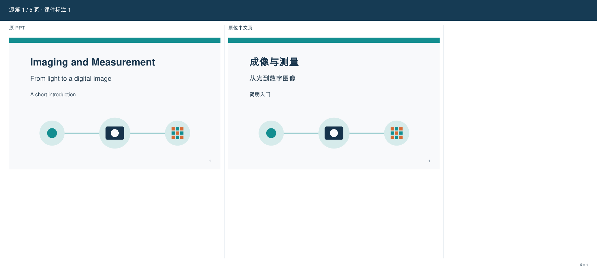
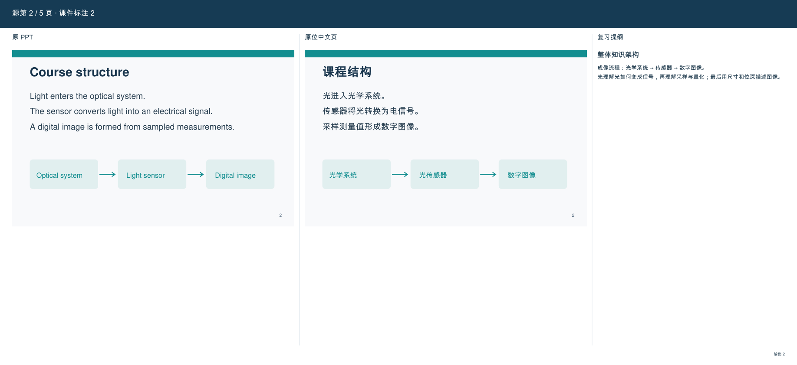
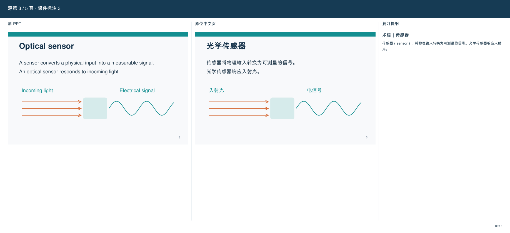
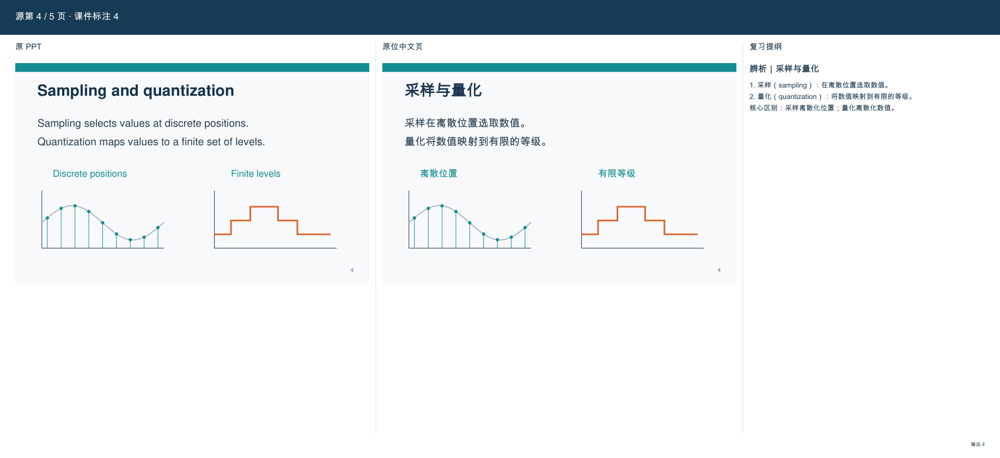
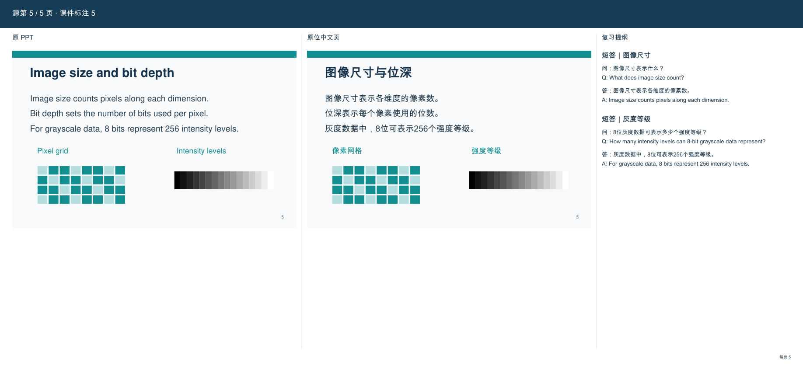

# Slide Page Translate · 三栏课件翻译与精简复习提纲

把课件做成 **原 PPT｜原位中文版｜复习提纲** 三栏 PDF。第二栏保留原图和版式，第三栏合起来是一份简短、可直接背诵的复习资料。

- **原 PPT**：完整保留原页、插图、图表、公式和页序。
- **原位中文版**：在原位置替换外文，保留原字号与颜色，尽可能还原字体。直接复用原插图，不下载或重画。
- **复习提纲**：按整份课件组织，选择整体知识架构、重要术语、中英双语短答和易混辨析。不逐页套模板，无内容时第三栏完全留空。

当前模型直接理解、翻译和编写复习内容，脚本负责原位替换、数据校验与排版，不需要额外翻译 API。默认使用已实现的 schema v2；历史双栏仅通过 `--layout two-column` 明确选择。

## 第三栏怎么写

| 内容 | 原则 |
|---|---|
| 整体知识架构 | 简述章节组织与知识关系，通常写一次 |
| 概念与术语 | 简短定义和必要澄清，优先摘用 PPT |
| 常规短答 | **问题、答案均有中文和英文**；问答相邻，答案尽量用原句，短而完整 |
| 易混辨析 | 简写“1 是什么；2 是什么；核心区别是什么” |

四类按课件内容取舍，不要求每页或每份课件凑齐。标题、目录、过渡、参考页可留空；目录能帮助理解整体架构时也可写。跨页去重，不追加固定学习目标、自测区、复习建议或占位语。来源保存在数据中；没有正式考试依据时称“复习提纲”，不声称官方考纲或必考。

## 新测试案例：成像与测量入门

这是一份为演示编写的 **5 页原创合成课件**。文字、箭头、曲线和图形均由仓库脚本生成，不使用真实课程、学生材料、个人信息或第三方截图。公开 PDF 的作者字段为空，例图不含人名、学校标识、邮箱及本机路径。

[查看原课件 PDF](assets/examples/imaging-basics-source.pdf) · [查看完整三栏 PDF](assets/examples/imaging-basics-three-column.pdf) · [查看示例内容与生成脚本](scripts/create_demo.py)

| 页 | 内容 | 第三栏处理 |
|---|---|---|
| 1 | 标题页 | 完全留空 |
| 2 | 成像流程 | 一次性说明整体知识架构 |
| 3 | 光学传感器 | 必要术语定义 |
| 4 | 采样与量化 | 简短结构化辨析 |
| 5 | 图像尺寸与位深 | 两组中英双语题目与答案 |

**标题页：第三栏留空，前两栏保留原图。**



**整体架构：只说明课件如何组织、知识之间有什么联系。**



**术语：必要的短定义，不扩成百科条目。**



**辨析：概念各是什么，核心区别是什么。**



**短答：中英文题目与答案相邻，可直接背诵。**



例图来自脚本的实际输出，不是效果设计图。本例中文使用 Arial Unicode 回退字体，标题使用合成粗体；字号、基线和颜色保持源值。不同运行环境可用 `--font` 指定中文字体，字形可能有差异。此例验证原生 PDF 文字、矢量图复用、空栏、四类内容与双语短答；不代表任意扫描件、复杂字体或 PPTX 均能无损编辑。

## 安装与使用

把整个仓库作为 `slide-page-translate` 技能目录保留，尤其不要拆开三个执行模块。先安装 Python 3.10+ 依赖，并准备覆盖中文的 TrueType 字体：

```bash
python -m pip install -r scripts/requirements.txt
```

在技能目录运行：

```bash
python scripts/slide_translate.py prepare "课件.pdf" --work "job"
# 当前模型查看 job/pages、deck-context.json 和 prompts，
# 按请求 ID 将完整翻译与复习内容保存到 job/responses/<chunk_id>.json。
python scripts/slide_translate.py validate --work "job"
python scripts/slide_translate.py audit --work "job"
python scripts/slide_translate.py build --work "job" --output "三栏复习资料.pdf"
python scripts/slide_translate.py verify --work "job"
```

没有可用默认字体时，在 `build` 加 `--font "中文字体.ttf"`。只完成部分批次可用 `validate --partial`。`verify` 生成预览后，仍须检查所有页面与替换区域，不能把程序通过当成语义或视觉验收。

每页第一批响应使用 `study: {"mode":"outline", "page_kind":"content", "points":[...]}`；无复习内容用 `points: []`；后续批次使用 `study: null`。短答必须提供 `question_zh`、`question_en`、`answer_zh`、`answer_en`。完整接口见[运行说明](references/runtime.md)。正式考纲可通过 `prepare --exam-syllabus "考纲.txt"` 接入。

## 保真与输入边界

- 默认输出 PDF。PPT/PPTX 先由 LibreOffice 转成静态 PDF，**不输出可编辑中文 PPTX**；应核对转换后的字体、公式和裁切。
- 前两栏等比例缩放。源字体不含中文时使用回退字体并记录；字形、字重和度量可能不同，不承诺完全复原。
- 译文在源字号下放不进原区域时阻止构建，不自动缩字、删条件或截断。
- 原生图中文字按原对象翻译。漏抽的栅格小字需要人工核实位置与背景；复杂背景只有用户明确允许局部改动时才在支持的 PyMuPDF 路径处理，并披露近似。
- 第三栏过长时独立续页；但默认应先写得精简，而非把讲义塞进窄栏。

## 复现案例与维护

```bash
# 1. 创建公开合成源文件和待视觉复核的响应
python scripts/create_demo.py
# 2. 查看 tmp/demo-job/pages 中全部原页后，明确标记已复核并构建
python scripts/create_demo.py --build-reviewed
# 无默认中文字体时，上一步加 --font "中文字体.ttf"
# 3. 查看 assets/examples 中全部五张输出图片及 PDF

# 运行测试、同步独立工具包
python -m unittest discover -s scripts -p 'test_*.py' -v
python scripts/build_model_only_kit.py
python scripts/build_model_only_kit.py --check
```

示例脚本只包含这份固定合成课件的人工编写译文，不是对任意文档做词典替换的翻译器。工作目录已有内容时不会覆盖；重新制作可指定新的 `--work` 目录。

测试覆盖翻译数据契约、原位几何、字体回退、图字覆盖、来源检查、溢出、续页、空白第三栏和双语短答。单文件工具包由当前规范与三个模块生成，`--check` 检查是否同步。测试不能代替具体课件的内容与视觉验收。

真实课件、任务目录和报告默认不入库；只有这里列出的两份合成示例 PDF 允许跟踪。发布新案例时应检查页面、文件名、PDF 元数据、图片和脚本中的个人信息与本机路径。

## 文档

| 文件 | 内容 |
|---|---|
| [SKILL.md](SKILL.md) | 技能入口与执行要求 |
| [运行说明](references/runtime.md) | CLI、JSON 契约、依赖与能力边界 |
| [版面规范](references/three-column-layout.md) | 原位中文页、原图、字号与位置 |
| [复习提纲规范](references/study-guide.md) | 四类内容、取舍、来源与简洁性 |
| [质量标准](references/quality-examples.md) | 翻译、版面与复习内容验收 |
| [图中文字](references/visual-notes.md) | 原图复用与图字替换边界 |
| [GitHub 方法调研](references/github-study-projects.md) | 方法来源及采纳与取舍 |
| [纯聊天交接](references/model-only.md) | 当前模型与执行端协作 |
| [MODEL_ONLY_KIT.md](MODEL_ONLY_KIT.md) | 可独立交接的规范、代码与依赖 |
