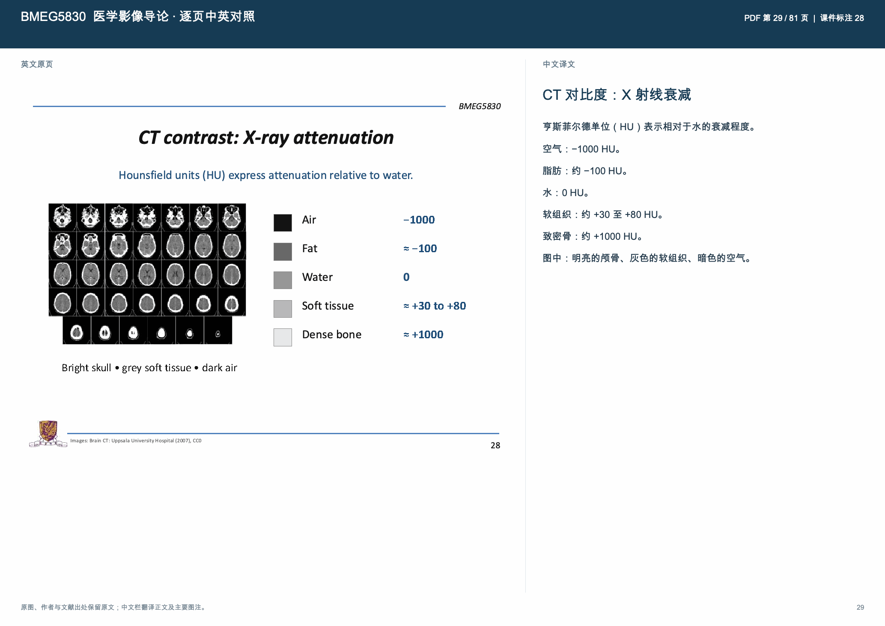
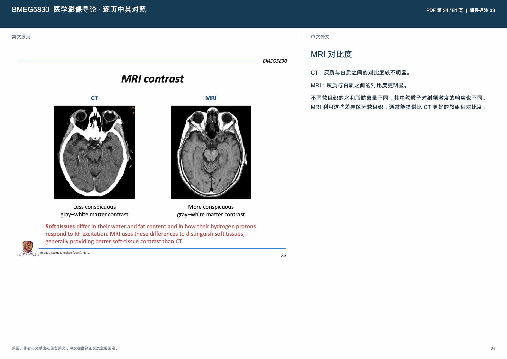
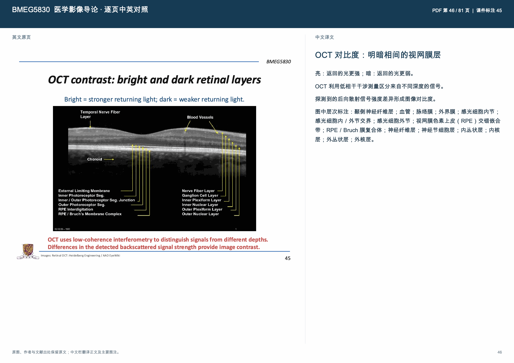
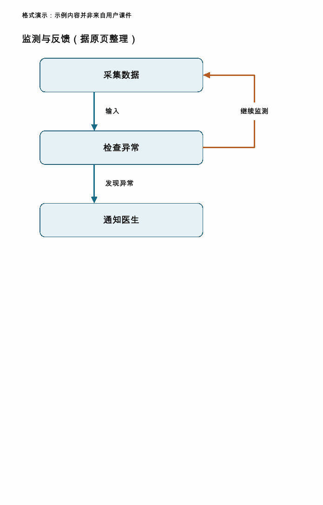

# Slide Page Translate · 课件逐页对照翻译

将课件按实际页码逐页翻译成中文，输出左侧原页、右侧中文的 PDF。适用于能运行脚本的 Agent，也提供普通聊天模型可用的操作说明和完整代码。

## 86 页 PPT 人工测试耗时

| 使用方式 | 模型 | 思考强度 | 运行时间 |
|---|---|---|---|
| Agent | GPT-5.6 Luna | 中 | **8 分 11 秒** |
| ChatGPT | GPT-5.6 Sol | 中 | **8 分 23 秒** |

以上为用户提供的单次人工测试记录。

### Agent 实测 token 与费用

以下用量来自上述 Agent 测试的本机运行日志；费用按 API 标准单价折算。

| 用量项目 | Token 数 |
|---|---:|
| 非缓存输入 | 165,197 |
| 缓存输入 | 2,375,040 |
| 输出（包含推理） | 16,628 |
| **总计** | **2,556,865** |

**Agent 本次模型用量的 API 等价费用：约 ¥0.67（$0.10049）。**

计算口径（2026-09-11）：GPT-5.6 Luna 每百万 token 的非缓存输入、缓存输入、输出单价分别为 $0.20、$0.02、$1.20；按 1 美元 ≈ 6.707 元人民币换算。公式为 `(165197 × 0.20 + 2375040 × 0.02 + 16628 × 1.20) ÷ 1000000 × 6.707 ≈ ¥0.67`。[模型官方价格](https://developers.openai.com/api/docs/models/gpt-5.6-luna) · [汇率来源](https://www.foreignexchangeresource.com/forex_rates.php?a=CNY&c=USD&d=20)

这是已记录模型 token 的 API 等价估算，不是订阅账户的实际扣费，不含额外工具费用。ChatGPT 那次未获取完整 token 统计，因此不列费用，也不据此比较两种方式的实际成本。

**模型负责翻译，Python 程序负责拆页、编号、校验、排版和导出。运行时不依赖其他 Skill。**

**快速上手：** [给 Agent 使用](#给-agent-使用) · [给普通聊天模型使用](#给普通聊天模型使用)

## 翻译效果预览

以下选自医学影像课件的逐页对照翻译 PDF：左侧保留英文原页，右侧为中文译文，同时标注 PDF 实际页码和课件印刷页码。点击图片可查看大图。

### CT：数值与单位对照

保留组织灰度示例，并对应翻译 HU 数值、单位及说明（PDF 第 29 页，课件标注第 28 页）。



### MRI：医学图片与正文对照

保留 CT 与 MRI 的原始对比图，逐项翻译灰白质对比和软组织说明（PDF 第 34 页，课件标注第 33 页）。



### OCT：图中标签与层次说明

保留视网膜分层图，并在中文栏补充层次标签的翻译（PDF 第 46 页，课件标注第 45 页）。



截图保留原页图表出处，用于展示翻译与排版效果。

## 功能

- 保留完整原页，同时标注源文件页码和课件印刷页码；重复、缺失或跳号的页脚不会改变源页顺序。
- 按页和文字长度拆成小批次；已完成的译文可保存、校验和继续处理。
- 检查文档身份、漏批、漏条目、重复编号和空译文。
- 中文保持可读字号；长页自动续页，不以缩小字体或截断文本强行塞入一页。
- 支持图内文字补译与无法辨认标记；未看图的结果必须明确披露。
- 最终成果格式为 PDF；JSON 和预览图片仅为中间文件。

## 输入格式

| 输入 | 处理方式 |
|---|---|
| PDF | 直接保留原页 |
| PPT / PPTX / ODP 等 | 通过本机 LibreOffice 转成 PDF |
| PNG / JPEG / TIFF / BMP / WebP，或图片目录 | 自动按图片顺序生成原页 |
| Keynote、在线幻灯片、网页及其他格式 | 原应用导出或打印成 PDF，通过 `--normalized-pdf` 接入 |

不限制原始课件格式，但无法自动解析的格式需要原应用完成 PDF 导出。扫描页可结合视觉模型、人工转录或可选的本机 Tesseract OCR。

## 给 Agent 使用

适合能读写文件、运行 Python，并能查看课件图片的 Agent。

1. **安装一次**：下载本仓库，将整个文件夹命名为 `slide-page-translate`，放入 Agent 的技能目录。不要只复制 `SKILL.md`，还需要随附的脚本。如果 Agent 支持从 GitHub 安装技能，也可以把本仓库链接交给它安装。
2. **提供课件**：上传文件，或告诉 Agent 本地文件路径。
3. **发送下面这句话**：

> 使用 slide-page-translate，把这份课件按实际页码逐页翻译成中文。左侧保留原页，右侧放中文译文，保留课件页码。请完成拆页、翻译、校验和排版，检查后交付 PDF。

支持 `$技能名` 的环境可以写 `$slide-page-translate`。Agent 会按照 [SKILL.md](SKILL.md) 调用随附脚本；你不需要逐条运行命令，也不需要另外上传 `MODEL_ONLY_KIT.md`。

**没有技能安装功能也可以用**：把仓库放到 Agent 可读取的目录，告诉它“先读取这个目录的 SKILL.md，再按里面的步骤处理课件”。首次使用可能需要安装 Python 依赖、字体或格式转换器。

## 给普通聊天模型使用

不需要安装 Skill。先确认聊天平台是否支持运行 Python、读写文件。

### 平台能运行代码

上传 [MODEL_ONLY_KIT.md](MODEL_ONLY_KIT.md) 和课件，然后发送：

> 请按工具包中的步骤处理这份课件，使用附带的 Python 代码，不要重写程序。逐批翻译并保存结果，完成校验和排版后给我实际生成的 PDF 文件。

工具包已经包含完整代码和运行说明，不需要再上传 ZIP。平台仍需具备相应依赖和文件处理能力；如果不能执行其中的步骤，就采用下面的方式。

### 平台只能聊天，不能运行代码

**你运行程序，模型只翻译。** 下载并解压仓库后，按下面的[命令行流程](#命令行流程)操作：

1. 在电脑上安装依赖，运行 `prepare` 拆页，得到 `job` 文件夹。
2. 每次把一个提示词文件（如 `job/prompts/p0001-c001.txt`）的全文发给模型，并附上提示词指定的原页图片（如 `job/pages/p0001.jpg`）。
3. 把模型返回的 JSON 保存为对应文件（如 `job/responses/p0001-c001.json`）。依次完成其余批次；用 `validate --partial` 随时检查，出错只重做对应批次。
4. 全部完成后，运行 `validate`、`build` 和 `verify`，检查并取得 `对照翻译.pdf`。

小模型一次只处理一批，不必记住整份课件。还可在 `prepare` 时加 `--chunk-chars 600`，进一步缩小每批文字量。

如果模型不能看图片，需要先提供 OCR 或人工转录，并核对图中标签；不能假称已检查图片。**如果你和平台都不能运行代码，纯聊天模型只能给出译文，无法直接生成本项目的 PDF。** 更详细的步骤见[纯模型使用方法](references/model-only.md)。

## 命令行流程

需要 Python 3.10+、可嵌入且覆盖中文字形的 TrueType 字体。转换 Office 文件时另需 LibreOffice，OCR 时另需 Tesseract。

在仓库根目录执行：

```bash
python -m pip install -r scripts/requirements.txt
python scripts/slide_translate.py prepare "课件.pdf" --work "job"
```

将 `job/prompts/` 中每个提示词与对应的 `job/pages/` 原页图片交给模型，把响应 JSON 存入 `job/responses/`，文件名保持对应的 `chunk_id`。

```bash
# 每完成一批可校验一次
python scripts/slide_translate.py validate --work "job" --partial

# 全部译完后校验并生成 PDF
python scripts/slide_translate.py validate --work "job"
python scripts/slide_translate.py build --work "job" --output "对照翻译.pdf"
python scripts/slide_translate.py verify --work "job"
```

查看 `job/qa/` 的预览，并核对最终 PDF。字体、OCR、其他格式、恢复与排错详见 [运行说明](references/runtime.md)。

## 仓库内容

```text
SKILL.md                  Agent 的技能入口
agents/openai.yaml        可选界面元数据
scripts/slide_translate.py 固定执行程序
scripts/requirements.txt   Python 依赖
scripts/test_pipeline.py   自动化机制测试
references/               分场景说明
MODEL_ONLY_KIT.md         给普通模型的自包含备用版本
assets/examples/          README 翻译效果截图
```

没有额外的“技能包运行时”。ZIP 仅是这些文件的分发形式，不需要与本目录同时安装。仓库仅附上述效果截图，不附带完整课件、完整译文 PDF、商业字体或模型凭据。

## 验证与边界

```bash
python scripts/test_pipeline.py
```

发布前已通过 11 项机制测试，并用独立 Agent 完成含重复页码、图片文字和文档内指令的三页样例。另对 81 页课件完成拆页验证，检查了长译文续页与旋转、裁剪页面的排版。

这些检查不等于对所有小模型或所有操作系统的质量保证。模型的翻译准确性、专业术语、OCR 和图中标签仍需对照检查。当前未在本环境实测 LibreOffice 和 Tesseract 转换路径；缺少转换器时可使用原应用导出的 PDF。

程序不调用模型 API、不上传文件；如果用户主动把页面发送给外部模型，该传输由用户所用的平台处理。无需为本程序配置 API Key 或 GitHub Secrets。


## 译文层级

根据原页的实际结构给每条译文填写 `role`，不要把所有内容都排成正文，也不要为了强调而把正文改成标题。跨批次仍看同一原页判断；保持 ID、顺序、信息完整，不合并或删去断行条目。

| role | 用途 | PDF 样式 |
|---|---|---|
| title | 本页主标题 | 21 pt 加粗 |
| heading | 小标题 | 16 pt 加粗，段前留白 |
| body | 正文、不确定的类型 | 13 pt |
| bullet | 列表项 | 13 pt 悬挂缩进，保留原编号 |
| caption | 图注、图中补充 | 11 pt 灰蓝色 |
| footnote | 脚注、文献出处 | 10 pt 灰蓝色 |

例如：`{"id":"p0001-t0001","zh":"医学成像简介","role":"title","status":"translated"}`。`zh` 使用纯文本，不用 Markdown 或 HTML 设置样式。标题使用字体描边加填充加粗，无需另装中文粗体字体。小标题尽量和后面的正文一起换页；长段落自动续页，不缩小字号。

旧响应需要补齐 `role` 并通过质量检查后才能导出；要让旧译文也有标题层级，先参照原图补充 role，再 build。非法 role 会被校验拒绝。


## 原表格按表格翻译

原页出现表格，中文栏也优先使用真正的表格，不能把单元格拼成散文或用截图代替译文。保留行列对应、表头层级、行标识、单位、空白格和脚注；看不清的格子明确写“无法辨认”，不能补值。合并单元格可通过重复上级表头展开，但必须明确归属。宽表按列拆分并重复行标识；长表跨页重复表头，保持可读字号。

在首个相关 `items` 条目中保留 `id`、`zh`、`status`，设置 `role="table"`，增加二维字符串数组 `rows` 和整数 `header_rows`（无表头为 0）。例如：

```json
{"id":"p0001-t0002","zh":"成像方式对照","status":"translated","role":"table","header_rows":1,"rows":[["方式","特点"],["MRI","软组织对比度高"],["CT","使用 X 射线"]]}
```

所有原条目仍逐一提交非空译文；其余已被该表覆盖的条目增加 `table_ref="p0001-t0002"`，脚本仅在首条位置绘制整表，避免重复。引用只能指向同一源页的表格。跨批次时依据同一原页填写整表，后续批次引用原表 ID；不要为凑结构改动 ID。未提取出的整表可放入第一批 `figure_notes`，保留 `source`、`zh`、`status`，同样提供 `role`、`rows`、`header_rows`。

单元格只能填纯文本；每行列数必须相同，空格填空字符串，表头行数必须小于总行数。检查渲染后的每张表，逐格核对对应关系、数字、单位、表头和续页。结构校验不能代替内容核对。旧 job 的提示词不会自动更新，继续旧任务时也应把本节规则交给翻译模型。

## 译文质量检查

逐句翻译，禁止用词典替换生成中英夹杂的正文。导出前运行 `audit --work job`；`build` 也会自动执行该检查。缺失 role、“译文：”占位、未解释的英文残留会阻止导出。质量报告为 `job/quality-report.json`；修正后重试。新旧任务都须补齐内容类型并核对自然中文，不能把校验通过当作语义准确。

阅读[完整正反例与断行处理](references/quality-examples.md)。

## 为学习保留关系，而不只是翻译词语

翻译前先看原页，判断概念之间的关系：分组、上下级、并列、步骤、条件分支、反馈、因果、时间先后或持续时间。箭头、连线、容器、颜色和空间位置可能携带信息，不能按抽取文字的顺序堆词。位置相邻不等于因果，连线不等于时间依赖。

按原页选择表达：分类或概念关系可整理为关系图，流程用流程图，对比用表格，事件顺序用时间轴，有明确起止时间的安排用甘特图。普通段落用标题和列表即可，不强行加图。原图已有学习关系但译文会丢失时，应整理中文图；仅为装饰不加图。

左侧保留原页，右侧先给完整中文译文，再附“据原页整理”的中文结构图。图中节点和线条要与原文对应；图不是摘要替代品，不能删除原条目或省略条件。原页没给的因果、分支、时间、持续天数、依赖关系不能补造。连线不清时在正文标明不确定，不猜图。专业解释必须以原页为依据，不能额外增加医学建议。

先查看原页，再判断是否需要整理；不能用文字抽取是否为空判断是否有图。遇到复杂图可分成有关联的小图并注明共享节点和跨图连接，保持全部关系可追踪。看不到原图时不能声称已重建原图，先解决看图条件。

验收时用中文回答：有哪些概念？谁属于谁？过程如何发生？在哪个条件分支？哪些任务同时进行？逐条核对箭头、条件与时间范围。只译了标签而丢掉关系，仍然是不完整的学习材料。

需要整理图形时读取[中文结构图格式与示例](references/learning-diagrams.md)。

## 图形排版默认规范（所有模型模式一致）

流程图统一采用已确认的清晰样式：主流程自上而下，蓝色粗实线和明显箭头直连；节点使用浅色圆角矩形、文字放大居中；条件直接写在线旁。反馈回路放右侧，用橙色区分，明确指回目标节点。颜色用于区分路径，不额外赋予“安全/危险”等原文没有的含义。

禁止将连线全部挤在左侧，再让读者查数字图例理解关系。旧示例第二页的“左侧多条线＋编号说明”不是合格模板，不得模仿。复杂关系若不能清楚绘制，改用有明确标题的分组列表或关系对照表，保留关系说明；不能为了套用上下流程样式，把并列或分类关系画成先后顺序。

使用当前脚本时，将真实连续主流程按顺序放入 nodes，每对相邻节点填写原页确实存在的 edges；最多一条返回前面节点的反馈边，即可自动采用清晰流程样式。原图不满足这种结构时，不要编造连线以触发布局；使用表格、分层列表或合理拆分的子流程表达。时间轴和甘特图仍按各自时间规则绘制。

验收标准：不读额外编号图例，也能直接看出从哪里开始、下一步是什么、什么条件走哪条路、反馈回到哪里。Agent、具备执行能力的普通模型及纯聊天模型的翻译请求都遵守本规范，不能因模式不同降低可读性。


